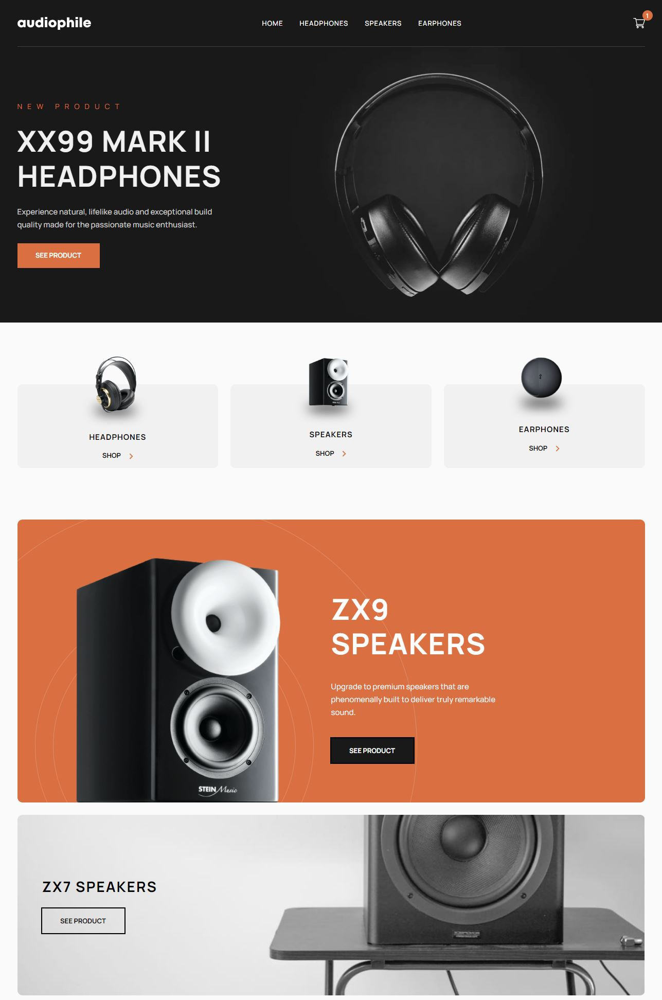

# Audiophile e-commerce website

The goal of this project is to build a platform which allow users to view different audio related products. There are three categories of items: headphones, earphones, and speakers. Each category is to have a certain amount of products, with the newest ones on top.

## Table of contents

- [Overview](#overview)
  - [The challenge](#the-challenge)
  - [Screenshot](#screenshot)
  - [Live](#links)
- [My process](#my-process)
  - [Built with](#built-with)
  - [What I learned](#what-i-learned)
  - [Continued development](#continued-development)

## Overview

### The challenge

Users should be able to:

- View the optimal layout for the app depending on their device's screen size :heavy_check_mark:
- See hover states for all interactive elements on the page :heavy_check_mark:
- Add/Remove products from the cart :heavy_check_mark:
- Edit product quantities in the cart :heavy_check_mark:
- Fill in all fields in the checkout :heavy_check_mark:
- Receive form validations if fields are missed or incorrect during checkout :heavy_check_mark:
- See correct checkout totals depending on the products in the cart :heavy_check_mark:
  - Shipping always adds 50€ to the order :heavy_check_mark:
  - VAT is calculated as 26% of the product total, excluding shipping :heavy_check_mark:
- See an order confirmation modal after checking out with an order summary :heavy_check_mark:
- Keep track of what's in the cart, even after refreshing the browser :heavy_check_mark:

### Screenshot

### Live

- Live Site : [Click Me](https://ecommerce-antonis-maras.netlify.app/) :rocket:

## My process

### Built with

- React
- React Router
- React Query
- Axios
- Firebase Realtime Database
- Sass
- Framer-Motion
- Formik
- Yup

### What I learned

This project was a big test for myself because i wanted to create something complex as a e-commerce website.
My goals were to follow and be precise with the figma design provided by FrontEnd Mentor as much as possible while using mobile first workflow, to setup my styling with Sass and to integrate libraries like React Router, Axios and React Query to fetch data from Firebase.
Set up the state management with the help of the ContextApi and Reducer hook, handling images and avoiding as much as possible any layout shift.
And finally to learn how to use Formik and Yup for my form setup and validation.

### Continued development

- Create unit and integration tests with Jest/React-Testing-Library.
- Optimize user experience.
- Write quality code.
